# Software-based fault-tolerance (a proof of concept)
This repository was created a part of my master project.
It implements n-of-m systems on any possible hardware but was tested and 
implement on raspberry pies. For development and simulation purposes a
docker file and according scripts were developed and used to simulate the
behavior of raspberry pies before deploying on to the hardware.

## Project Structure
```console
|_ config/ Contains the configuration files for different nodes, in this case for nodes 0 to 2
|_ docs/ Contains the documentation for this repository, atm only includes the mermaid chart
|_ scripts/ Contains useful scripts for deploying, configure on to real pies/docker containers
|_ src/ Contains the rust source files for this project.
```

## How it works
Below you can see the general process of how each individual system node will run. All of the nodes are ideally running the same binary without any needed changes due to different configuration files covered later. Due to this project not being implemented with a specific use case in mind, you have to implement the interfaces given through a function pointer to the function containing your critical calculations as f.e. gathering sensor data. This function needs to return a mem_alloc struct so the application can check calculate a CRC over the critical functions memory and then compare it with the different nodes. In src/bin/main.rs is an example how to implement and pass such a critical function to the main application. Also the output function (publish_vote) is just a place holder that only shows 1. who is the publisher of the voted value of all nodes and 2. what is the voted value.

```mermaid
stateDiagram-v2
%% Initial synchronization if cases
state startup_if <<choice>>
state init_sync_if <<choice>>
%% System loop if cases
state cyclic_sync_if <<choice>>
state exchange_crc_if <<choice>>
state vote_if <<choice>>
state exchange_vote_if <<choice>>
%% Error Handling if cases
state error_if <<choice>>
state system_valid_if <<choice>>

        [*] --> SystemStartup
        SystemStartup --> SystemLoop
        SystemStartup --> Failsafe
        SystemLoop --> ErrorHandling
        ErrorHandling --> Failsafe
        ErrorHandling --> SystemLoop
        %%SystemStartup --> Failsafe
        %%SystemLoop --> Failsafe

        %% Initial System startup
        state SystemStartup
        {
                [*] --> Startup
                Startup --> startup_if : Start health check
                startup_if --> InitialSynchronization : Initial health check correct
                startup_if --> GoToFailsafe : Initial health check failed
                InitialSynchronization --> init_sync_if : Synchronize cur_sys_size nodes
                init_sync_if --> GoToFailsafe : Not all INIT_SYNC messages received before timeout
                init_sync_if --> GoToSystemLoop: ALL INIT_SYNC messages receive before timeout
                
        }

        %% Running system loop
        state SystemLoop
        {
                %%% Functional States
                [*] --> CalcCritical
                CalcCritical --> ExchangeCRC : Calculation Finished
                
                ExchangeCRC --> exchange_crc_if : CRC received from Cursys - 1 Particpants
                exchange_crc_if --> Vote : All CRC's received before timeout
                exchange_crc_if --> EnterErrorHandling : Atleast one CRC missing => timeout
                
                Vote --> vote_if : Voted locally
                vote_if --> ExchangeVote : Voting with no errors detected
                vote_if --> EnterErrorHandling : Faulty CRC detected while voting

                ExchangeVote --> exchange_vote_if : Exchange CRCs
                exchange_vote_if --> PublishVote : No wrong Voter occured
                exchange_vote_if --> EnterErrorHandling : A node voted a wrong publisher/crc

                PublishVote --> Reset : Published voting result from voted publisher
                Reset --> CyclicSynchronization : Reset for next iteration
                
                CyclicSynchronization --> cyclic_sync_if : CurSys = InitSysSize before timeout
                cyclic_sync_if --> CalcCritical : ALL CYCLE_SYNC messages received before timeout
                cyclic_sync_if --> EnterErrorHandling : Atleast one CYCLE_SYNC message not received => timeout
                
                %%% Reentry After Error Handling
                ReentryAfterError --> PublishVote : lastState == Vote
                ReentryAfterError --> Vote : lastState == ExchangeCRC
                ReentryAfterError --> CalcCritical : lastState == CyclicSync
        }

        state ErrorHandling
        {
                [*] --> error_if
                error_if --> EntryFailsafe : Unit flagged as defect
                error_if --> SystemValidTest : Unit not flagged as defect 
                SystemValidTest --> system_valid_if : Check system healthy
                system_valid_if --> Reentry : cur_sys_size >= min_sys_size
                system_valid_if --> EntryFailsafe : cur_sys_size < min_sys_size 
        }

        state Failsafe
        {
                [*] --> UnitFailsafe : Unit can't get rescued
        }
        %% Failsafe
```


### Configuration files
Each node needs a configuration file (config.json) to work. The configuration files contain information about:
```console
{
    "system_id":0, => Exact identification of a single node, should be a unique number between 0 - 255
    "system_size":3, => Number of system size upon start f.e. a 2-of-3 system would have a system_size of 3
    "min_sys_size":2, => Contains the minimal number to be able to run the system
    "timeout_ms":10000, => The timeout in miliseconds between send-receiv loops for gathering/sending system info
    "port":"3841" => udp port were messages are sent and received from.
}
```
Like this you can start multiple nodes with the same built binary, but if you f.e. want different binaries with different critical functions (for which are also plenty use cases) this can be done aswell. The configuration file will be loaded by the environment variable **CONFIG_PATH**, which therefore have to be set to the path of the config.json file of the specific node.

### Communication
The different system nodes communicate over udp broadcast messages, were the broadcast addresses are at the moment automatically fetched from the **eth0** interface of the different nodes. The port of the udp messages is set via the configuartion files described above. Due to listening on all interfaces (0.0.0.0) we don't need another listening udp address.

## General error cases
It's important to know which general error cases are existing in the system, to be able to handle them in the running system.
Therefore here is a short overview over possible error cases:
| Error case  | Handled by | Impact on defect node |
|---|:---:| ---|
| Node just shutdowns/reboots/exits application silently|  Message fetch timeouts| Gets removed from the session |
| Node gets caculates a wrong CRC due to a defect | Voting of the CRC value | Gets removed from the session |
| Node gets votes wrong publisher | Voting of publisher value | Gets removed from the session |
| Node fails receiv messages but can send messages | Declares himself defect due to not enough messages received, other nodes will notice after node exited | Gets removed from the session after next send-receiv loop|
| Node fails to send messages but receives them | ? | ? |
| General not sending/not available/ | Gets handled by send-receiv timeouts | Gets removed from the session |
# Setup

## General setup and prerequisites

## Simulation setup

## Deployment setup

