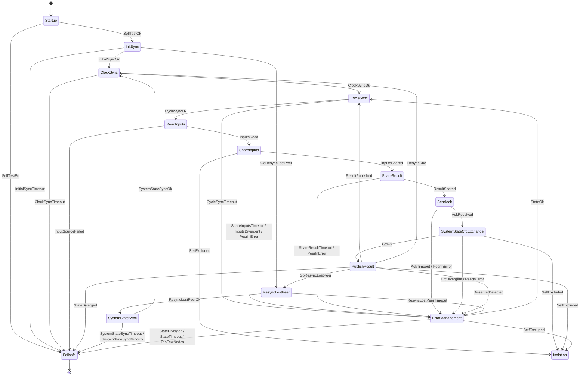

# MooN-Framework

Software-based fault tolerance for MooN systems, in Rust.

The same binary runs on N nodes. Every cycle each node reads its own
sensor input, computes the same safety function, and the nodes reduce
their results to one decision by majority vote. A node that disagrees,
falls silent or drifts out of step is excluded by a vote of its peers.
When too few nodes are left to vote, the system goes fail-stop instead
of guessing.

```text
    node 0  ─┐
    node 1  ─┼─ UDP multicast ─→  per-cycle vote  ─→  one decision
    node 2  ─┘                                       (one publisher)
```

The framework itself is domain-independent. The safety function, the
voting rule and the actuator interface are supplied by the application
through six traits. `src/brake/` is a worked example built around an
ETCS-style braking curve, and `src/bin/node.rs` is the roughly thirty
lines of wiring that turn it into a runnable node.

Developed as part of a master's thesis on a SIL 2 targeted 2oo3 voting
system. The deployment target is Raspberry Pi 4 hardware, but nothing
in the code is Pi-specific.

## Layout

```text
configs/    One TOML file per node. Self-verifying, see Configuration.
scripts/    Legacy deployment helpers from the predecessor project.
src/
  bin/node.rs           Entry point for the brake example.
  brake/                The example application.
    braking_curve.rs      Safety function and payload types.
    computation.rs        Computation impl, input consolidation and gate.
    voter.rs              MooN voting rule for brake results.
    sink.rs               Safety gate in front of the actuator.
    selftest.rs           Power-on check.
  framework/            Domain-independent core.
    traits.rs             The six seams an application implements.
    state_machine.rs      Node states, events, transition function.
    runner/               The cyclic driver.
      phases.rs             One handler per node state.
      collect.rs            Generic send-and-wait loop.
      ingest.rs             Routing received frames into the state.
      diag.rs               Diagnostic command handling (feature-gated).
    state/                Everything a node knows.
      mod.rs                RunState, quorum arithmetic, snapshots.
      peers.rs              Roster and peer health.
      cycle.rs              Per-cycle payload buffers.
      observation.rs        Cross-observation, who saw whom.
      voting.rs             The exclusion vote.
    wire/                 Wire format.
      frame.rs              Datagram layout and payload variants.
      codec.rs              Fixed-buffer little-endian codec.
    transport.rs          Multicast socket, sequence and session tracking.
    clock_sync.rs         Cristian's algorithm, per-peer offsets.
    config.rs             Config file layout and integrity check.
    diagnostic.rs         Diagnostic channel and fault injection.
```

API documentation: `cargo doc --open`. The crate builds clean under
`#![warn(missing_docs)]`, so every public item is documented.

## The cycle

A healthy cycle walks seven phases. Each one broadcasts periodically
and waits for the non-lost peers, with a deadline measured as an offset
from the cycle anchor rather than from phase entry. Every healthy node
therefore hits the same deadline at the same wall-clock instant, which
is what keeps two survivors from timing out in different phases when a
third goes silent mid-cycle.

| Phase | What happens | Deadline |
|---|---|---|
| `CycleSync` | Barrier. Wait for every non-lost peer's beacon. | `cycle_sync_timeout_ms` |
| `ReadInputs` | Read the local sensor value. | none |
| `ShareInputs` | Broadcast the input, gate peers for input divergence. | `share_inputs_offset_ms` |
| `ShareResult` | Broadcast the computation result. | `share_result_offset_ms` |
| `SendAck` | Attest what was received, nominate a publisher. | `send_ack_offset_ms` |
| `SystemStateCrcExchange` | Compare system-state CRCs before anything is published. | `crc_offset_ms` |
| `PublishResult` | Vote, then publish on the elected publisher. | none |

Anything that goes wrong routes through `ErrorManagement`, which runs
the exclusion vote and either returns to `CycleSync` or goes to
`Failsafe`.



`NodeState::next` is a pure function and every state and event pair it
does not name falls through to `Failsafe`. An unexpected event in a
safety context is a reason to stop, not to improvise.

`Isolation` has no outgoing edge. A node that isolates itself stops
broadcasting and lets the remaining fabric drive the actuator; it does
not rejoin without a process restart.

## Design notes

**Exclusion needs two reporters.** A single node can never exclude
another, because that node could be the faulty one itself. With fewer
than two reporters the vote confirms nothing, error management runs into
its timeout and the node goes failsafe. A target also does not vote in
its own tally, so a faulty node cannot keep itself in by abstaining.

**Nobody is accused on one node's view alone.** Each node attests what
it received, and a peer is only attributed as missing when a strict
majority of reporters failed to see it. With no evidence at all nothing
is attributed, because the local receive path is then the more likely
fault.

**Masks are indexed against the sender.** Every peer mask on the wire
is a bit per node, ordered by the *sender's* peer list, so a receiver
has to translate positions before reading one. This only differs from
naive id indexing when node ids are non-contiguous, which is exactly
what happens after an exclusion.

**Divergence shows up as one CRC.** Roster, cycle counter,
configuration and application state are folded into one system-state
CRC that every node attests before anything is published. A divergence
anywhere surfaces the same way, and an even split has no majority to
side with, so it goes failsafe rather than picking a half.

**Rejoin is unanimous and probationary.** A returning node is readmitted
only if every healthy peer endorses it, then serves a probation term
during which it is on the wire but does not vote. Probation progress is
derived from the fabric-agreed cycle counter rather than counted
locally, so every node promotes it in the same cycle.

**Fail-safe beats availability.** `GoFailsafe` is accepted even from an
already-excluded node, and an exclusion vote that times out with no
votes received goes failsafe rather than parking in isolation.
Isolation is silent but never triggers the sink's emergency hook, which
is the wrong state to end up in by accident.

## Configuration

A node is configured entirely by one TOML file, passed with `--config`.
See `configs/node_0.toml`:

```toml
own_id = 0

[participants]
nominal          = 3     # nodes expected at startup
minimum          = 2     # safety floor, below this it is failsafe
probation_cycles = 10    # cycles a readmitted node serves before voting

[timing]
cycle_duration_ms = 20

share_inputs_offset_ms  = 5    # in-cycle deadlines, offsets from the
share_result_offset_ms  = 10   # cycle anchor, strictly increasing and
send_ack_offset_ms      = 14   # all fitting inside cycle_duration_ms
crc_offset_ms           = 17

init_sync_timeout_ms        = 15000
clock_sync_timeout_ms       = 500
cycle_sync_timeout_ms       = 10
error_mgmt_timeout_ms       = 20
state_sync_timeout_ms       = 500
resync_returning_timeout_ms = 5000
resync_healthy_timeout_ms   = 500

send_interval_ms         = 1    # retransmit interval, must be below
                                # every timeout above
stale_frame_threshold_ms = 100
resync_interval_cycles   = 500  # cycles between clock-sync rounds

[transport]
interface       = "eth0"
multicast_group = "239.10.0.1"
port            = 5555

[diagnostic]
enabled         = true
interface       = "eth0"
multicast_group = "239.10.0.2"
port            = 6666

[integrity]
algo     = "sha256"
checksum = "aa3b72...c198a"
```

The `[integrity]` digest covers a canonical form of the file with the
`[integrity]` section removed. Comments, whitespace and key order do not
affect it; every value does. A file whose digest does not match is
rejected at startup rather than loaded with a warning. Regenerate it
after any edit with `python -m harness.config_gen` from the diagnostic
tool repository.

Timing is validated at startup and panics on an inconsistency: offsets
must be strictly increasing, the last one must fit inside the cycle, and
`send_interval_ms` must be below every timeout. A phase whose retransmit
interval reaches its own timeout would expire before it ever
retransmitted, which looks exactly like a silent peer in the logs.

Nodes differ only in `own_id`, the interface name and the checksum.

## Building and running

```bash
cargo build --release                      # production, no injection code
cargo build --release --features diagnostic # with the diagnostic channel
```

```bash
node --config /opt/moon/config/node.toml [--log-dir /opt/moon/logs]
```

Logs always go to stdout. With `--log-dir` an additional per-session
file sink is enabled at `<dir>/node_<id>_session_<session>.log`, plus a
stable `node_<id>_current.log` symlink repointed at every start. Both
sinks are written by worker threads so a slow reader cannot stall a
cycle. Set `RUST_LOG` to change the level.

Cross-compiling for Pi 4 or 5:

```bash
rustup target add aarch64-unknown-linux-gnu
sudo apt install gcc-aarch64-linux-gnu
cargo build --release --target aarch64-unknown-linux-gnu
```

### Running a fabric locally

The shipped configs use the loopback interface, so three processes on
one machine form a complete 2oo3 fabric:

```bash
cargo build --features diagnostic
./target/debug/node --config configs/node_0.toml &
./target/debug/node --config configs/node_1.toml &
./target/debug/node --config configs/node_2.toml &
```

All three have to be up before `init_sync_timeout_ms` expires. If
multicast frames do not arrive while `tcpdump` shows them on the wire,
check the host firewall first: a default-deny inbound policy blocks
ports 5555 and 6666 without any sign of it in the application logs.

### Deployment

Hardware deployment goes through the signed image and package tooling in
the `MooN-pi-gen` repository, and through the deploy and test tabs of the
diagnostic tool. The scripts in `scripts/` predate that and are kept only
for reference: they still assume a `config.json`, a `CONFIG_PATH`
environment variable and a binary called `main`, none of which match this
code. Do not use them against current nodes.

## Diagnostic channel

Built only with `--features diagnostic`. Nodes and the diagnostic GUI
share a second multicast group and exchange JSON telegrams. `GetStatus`
is answered immediately; everything else is staged and applied at the
next cycle boundary, so an injection takes effect on all targeted nodes
in the same cycle.

Available injections: suppression of Input, Result, Ack, CycleSync, CRC
or exclusion-proposal frames for N cycles; a bogus system-state CRC; a
wrong publisher nomination; a corrupted own result; an extra delay in
`ReadInputs`; a soft mute; a hard process exit; a targeted input applied
only to selected nodes; dropping all frames from a chosen set of senders,
which produces an asymmetric view without a real partitioner; and
spoofing the node-state byte in the frame header.

In production builds the feature is off and the injection code is not
compiled at all, rather than being disabled at runtime.

## Testing

```bash
cargo test                      # 162 unit tests
cargo test --features diagnostic
```

The unit tests cover the transition function exhaustively, the exclusion
vote and cross-observation rules, the quorum arithmetic, the wire codec,
the configuration integrity check and the brake example.

System-level tests live in the diagnostic tool repository as a pytest
harness of 39 fault-injection scenarios, run against either simulated
nodes or real hardware.

Coverage:

```bash
cargo install cargo-llvm-cov --locked
rustup component add llvm-tools-preview
cargo llvm-cov --branch --all-features --html --open
```

Use `--all-features`, otherwise the entire diagnostic path is missing
from the measurement. `src/bin/node.rs` and `transport.rs` will come out
low because they hold real sockets; exclude them with
`--ignore-filename-regex` rather than testing around them.

## Implementing your own application

Six traits in `framework::traits`, all implemented in `src/brake/` if you
want a reference:

| Trait | Question it answers |
|---|---|
| `InputSource` | What does a cycle read? |
| `Computation` | What does it compute, and when do two inputs count as the same measurement? |
| `Voter` | How are N results reduced to one, and who dissented? |
| `DecisionSink` | Is the decision safe to deliver, and what happens to it? |
| `SelfTest` | What does the node check before it joins? |
| `ApplicationStateProvider` | What domain state has to stay in step across nodes? |

Two conventions run through all of them. Payloads have a fixed wire size
so the cyclic path never allocates, and a fallible operation that fails
routes the node to failsafe. The framework never guesses a recovery: a
domain that wants to ride out a transient sensor fault has to say so
explicitly, for example by returning the last known good value from
`InputSource::read`.

Use `NoApplicationData` and `NoAppState` if there is no domain state to
synchronise.
