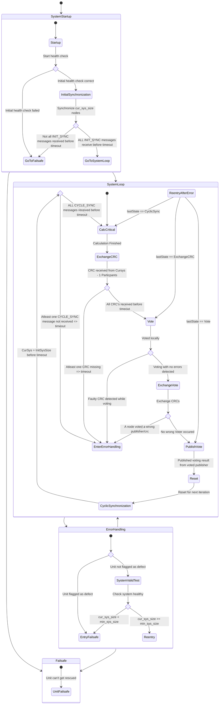

```mermaid
stateDiagram-v2
%% Initial synchronization if cases
state startup_if <<choice>>
state init_sync_if <<choice>>
%% System loop if cases
state cyclic_sync_if <<choice>>
state exchange_crc_if <<choice>>
state vote_if <<choice>>
state exchange_vote_if <<choice>>
%% Error Handling if cases
state error_if <<choice>>
state system_valid_if <<choice>>

        [*] --> SystemStartup
        SystemStartup --> SystemLoop
        SystemStartup --> Failsafe
        SystemLoop --> ErrorHandling
        ErrorHandling --> Failsafe
        ErrorHandling --> SystemLoop
        %%SystemStartup --> Failsafe
        %%SystemLoop --> Failsafe

        %% Initial System startup
        state SystemStartup
        {
                [*] --> Startup
                Startup --> startup_if : Start health check
                startup_if --> InitialSynchronization : Initial health check correct
                startup_if --> GoToFailsafe : Initial health check failed
                InitialSynchronization --> init_sync_if : Synchronize cur_sys_size nodes
                init_sync_if --> GoToFailsafe : Not all INIT_SYNC messages received before timeout
                init_sync_if --> GoToSystemLoop: ALL INIT_SYNC messages receive before timeout
                
        }

        %% Running system loop
        state SystemLoop
        {
                %%% Functional States
                [*] --> CalcCritical
                CalcCritical --> ExchangeCRC : Calculation Finished
                
                ExchangeCRC --> exchange_crc_if : CRC received from Cursys - 1 Particpants
                exchange_crc_if --> Vote : All CRC's received before timeout
                exchange_crc_if --> EnterErrorHandling : Atleast one CRC missing => timeout
                
                Vote --> vote_if : Voted locally
                vote_if --> ExchangeVote : Voting with no errors detected
                vote_if --> EnterErrorHandling : Faulty CRC detected while voting

                ExchangeVote --> exchange_vote_if : Exchange CRCs
                exchange_vote_if --> PublishVote : No wrong Voter occured
                exchange_vote_if --> EnterErrorHandling : A node voted a wrong publisher/crc

                PublishVote --> Reset : Published voting result from voted publisher
                Reset --> CyclicSynchronization : Reset for next iteration
                
                CyclicSynchronization --> cyclic_sync_if : CurSys = InitSysSize before timeout
                cyclic_sync_if --> CalcCritical : ALL CYCLE_SYNC messages received before timeout
                cyclic_sync_if --> EnterErrorHandling : Atleast one CYCLE_SYNC message not received => timeout
                
                %%% Reentry After Error Handling
                ReentryAfterError --> PublishVote : lastState == Vote
                ReentryAfterError --> Vote : lastState == ExchangeCRC
                ReentryAfterError --> CalcCritical : lastState == CyclicSync
        }

        state ErrorHandling
        {
                [*] --> error_if
                error_if --> EntryFailsafe : Unit flagged as defect
                error_if --> SystemValidTest : Unit not flagged as defect 
                SystemValidTest --> system_valid_if : Check system healthy
                system_valid_if --> Reentry : cur_sys_size >= min_sys_size
                system_valid_if --> EntryFailsafe : cur_sys_size < min_sys_size 
        }

        state Failsafe
        {
                [*] --> UnitFailsafe : Unit can't get rescued
        }
        %% Failsafe
```